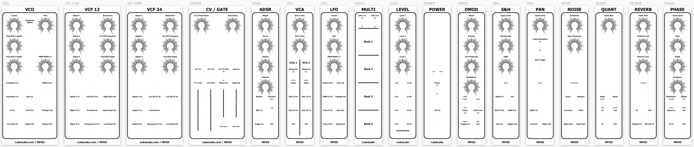

# Analog Synthesizer Panels

This repository contains the source files for my custom built, [Music From Outer Space](http://musicfromouterspace.com/index.php?MAINTAB=SYNTHDIY&VPW=1854&VPH=866) modular analog synthesizer.

## Artwork

[This Sketch file](MFOS/MFOS-Panels.sketch) contains the artwork for all of the below modules.

## CAD/CAM files

The [Carbide Create](https://carbide3d.com/carbidecreate/) files and G-code are listed below.

| Panel name | Description | Carbide Create | G-code |
| --- | --- | --- | --- |
| VCO | Voltage Controller Oscillator module | [2U - VCO.c2d](MFOS/Panels/2U&#32;-&#32;VCO.c2d) | [2U - VCO.nc](MFOS/Panels/2U&#32;-&#32;VCO.nc) |
| VCF12 | 12dB Voltage Controlled Filter module | [2U - VCF12.c2d](MFOS/Panels/2U&#32;-&#32;VCF12.c2d) | [2U - VCF12.nc](MFOS/Panels/2U&#32;-&#32;VCF12.nc) |
| VCF24 | 24dB Voltage Controlled Filter module | [2U - VCF24.c2d](MFOS/Panels/2U&#32;-&#32;VCF24.c2d) | [2U - VCF24.nc](MFOS/Panels/2U&#32;-&#32;VCF24.nc) |
| ADSR | Attack/Delay/Sustain/Release envelope generator module | [1U - ADSR.c2d](MFOS/Panels/1U&#32;-&#32;ADSR.c2d) | [1U - ADSR.nc](MFOS/Panels/1U&#32;-&#32;ADSR.nc) |
| VCA | Voltage Controlled Amplifier module | [1U - VCA.c2d](MFOS/Panels/1U&#32;-&#32;VCA.c2d) | [1U - VCA.nc](MFOS/Panels/1U&#32;-&#32;VCA.nc) |
| LFO | Low Frequency Oscillator module | [1U - LFO.c2d](MFOS/Panels/1U&#32;-&#32;LFO.c2d) | [1U - LFO.nc](MFOS/Panels/1U&#32;-&#32;LFO.nc) |
| MULTI | 4x4x4x4/8x8 passive multiplier module | [1U - MULTI.c2d](MFOS/Panels/1U&#32;-&#32;MULTI.c2d) | [1U - MULTI.nc](MFOS/Panels/1U&#32;-&#32;MULTI.nc) |
| LEVEL | Three channel passive level attenuator module | [1U - LEVEL.c2d](MFOS/Panels/1U&#32;-&#32;LEVEL.c2d) | [1U - LEVEL.nc](MFOS/Panels/1U&#32;-&#32;LEVEL.nc) |
| POWER | Simple power panel for dual supply rails | [1U - POWER.c2d](MFOS/Panels/1U&#32;-&#32;POWER.c2d) | [1U - POWER.nc](MFOS/Panels/1U&#32;-&#32;POWER.nc) |
| DMOD | Delayed modulation module | [1U - DMOD.c2d](MFOS/Panels/1U&#32;-&#32;DMOD.c2d) | [1U - DMOD.nc](MFOS/Panels/1U&#32;-&#32;DMOD.nc) |
| S&H | Sample and hold module | [1U - S&H.c2d](MFOS/Panels/1U&#32;-&#32;S&H.c2d) | [1U - S&H.nc](MFOS/Panels/1U&#32;-&#32;S&H.nc) |
| PAN | Stereo auto-panner module | [1U - PAN.c2d](MFOS/Panels/1U&#32;-&#32;PAN.c2d) | [1U - PAN.nc](MFOS/Panels/1U&#32;-&#32;PAN.nc) |
| NOISE | Noise generator module | [1U - NOISE.c2d](MFOS/Panels/1U&#32;-&#32;NOISE.c2d) | [1U - NOISE.nc](MFOS/Panels/1U&#32;-&#32;NOISE.nc) |
| QUANT | Voltage quantizer module | [1U - QUANT.c2d](MFOS/Panels/1U&#32;-&#32;QUANT.c2d) | [1U - QUANT.nc](MFOS/Panels/1U&#32;-&#32;QUANT.nc) |
| REVERB | Voltage controlled reverb module | [1U - REVERB.c2d](MFOS/Panels/1U&#32;-&#32;REVERB.c2d) | [1U - REVERB.nc](MFOS/Panels/1U&#32;-&#32;REVERB.nc) |
| PHASE | 8-stage phase shifter module | [1U - PHASE.c2d](MFOS/Panels/1U&#32;-&#32;PHASE.c2d) | [1U - PHASE.nc](MFOS/Panels/1U&#32;-&#32;PHASE.nc) |
| CVGATE | CV and Gate expander module | [2U - CVGATE.c2d](MFOS/Panels/2U&#32;-&#32;CVGATE.c2d) | [2U - CVGATE.nc](MFOS/Panels/2U&#32;-&#32;CVGATE.nc) |
| WAVEFREAK | Wave Freaker module | [2U - WAVEFREAK.c2d](MFOS/Panels/2U&#32;-&#32;WAVEFREAK.c2d) | [2U - WAVEFREAK.nc](MFOS/Panels/2U&#32;-&#32;WAVEFREAK.nc) |
| ECHO | Echo module | [2U - ECHO.c2d](MFOS/Panels/2U&#32;-&#32;ECHO.c2d) | [2U - ECHO.nc](MFOS/Panels/2U&#32;-&#32;ECHO.nc) |

## How to use these files

### Carbide Create

1. Download the desired .c2d file and open in [Carbide Create](https://carbide3d.com/carbidecreate/).
1. Customise the panels where desired.
1. Review the toolpaths and tools to make sure they'll work with your CNC machine.  I'm using the [Shapeoko 3](https://carbide3d.com/shapeoko/).
1. Export the G-code and load into your favourite CAM software.  I'm using [Universal Gcode Sender](https://winder.github.io/ugs_website/).
1. Cut the panel.  I'm using the [PreciseBits MN208-1250-019FC](https://www.precisebits.com/index.php?route=product/product&product_id=643&search=019FC&description=true), a 3.175 mm, ZrN coated, 2-flute stub end-mill.  I've cut more than 30 panels with a single end-mill and it's still going strong.  I'm running a Dewalt D26204K at full-speed (~27,000 RPM) with a feed-rate of 1,372 mm / min.

### Sketch

1. [Download the Sketch file](MFOS/MFOS-Panels.sketch) and open in your local copy of [Sketch](https://www.sketch.com/).
1. Customise the panels where desired.
1. Print with your favourite laser printer.  I'm using the Brother HL-1210W mono laser printer.
1. Use your favourite toner transfer method to transfer the design onto aluminium.  I'm using the Lowell LOOL280 A4 Home Laminator, customised to support much thicker sheets of aluminium.

## Warnings

- These panels were originally printed on 3.18 mm thick aluminium at a size of 90 mm x 223 mm for 2U wide and 45 mm x 223 mm for 1U wide.  You should double check these panels will fit into your rack before printing or cutting.
- Each Carbide Create toolpath has a _different_ depth of cut.  This is to take into account issues with the Shapeoko's belt-driven Z axis.

## More information

- [My blog](https://lukelabs.com) contains more details on [how you can create your own synthesizer front panels with Sketch](https://lukelabs.com/2019/03/23/how-to-design-a-synthesizer-front-panel-using-sketch/).
- You can see my current build progress over on [the LukeLabs.com Instagram page](https://www.instagram.com/lukelabsdotcom/).

## Questions?

If you have any questions, or would like to know more about my process, please send me an email at luke(AT)lukelabs(DOT)com.
